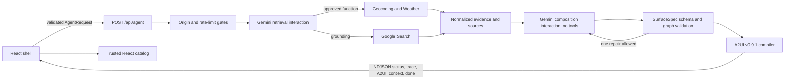

# Architecture

## Design intent

Agent UI Lab separates agent judgment from browser execution. Gemini can select retrieval tools, choose a surface type, organize information, and provide semantic component props. The application owns the shell, component implementations, responsive behavior, navigation, actions, URLs, and every executable byte.

This boundary makes the interface expressive without treating generated markup or code as trusted input.

## Request path



### 1. Client request

The browser constructs an `AgentRequest` with a UUID, a prompt of at most 1,000 characters, an optional context token, and a client context. The context contains only the semantic size class (`compact`, `medium`, or `expanded`), locale, time zone, preferred units, reduced-motion preference, and—only after explicit browser permission—coordinates.

The shell keeps the active prompt, follow-up context token, traces, and rendered messages in React memory. Reloading or selecting **New prompt** clears that state.

### 2. Function gates and stream start

`POST /api/agent` requires an exact allowed `Origin`, validates the complete request with Zod, derives an anonymous HMAC rate-limit key from network identity plus a server salt, and begins an NDJSON response immediately with a safe status event.

The function applies two fixed-window limits: 20 requests per 10 minutes and 100 per day. Upstash provides shared production counters when both REST variables are configured; otherwise the counters are process-local. The request is aborted after 45 seconds or when the client disconnects.

### 3. Retrieval

The first Gemini Interactions call uses `gemini-3.6-flash`, the stable `v1` API, `store: false`, and only two approved tools:

- `get_weather_bundle`, a typed custom function
- Google Search grounding

Custom function arguments are schema-validated. Stateless continuation appends every returned interaction step and the matching function result to the next request. No more than two custom-tool rounds are allowed.

Weather retrieval resolves a human-readable location, or reverse-geocodes coordinates that were explicitly approved by the browser. It requests current conditions, 24 hourly entries, five daily entries, and public alerts, then normalizes units and timestamps. Activity windows are scored deterministically in server code rather than delegated to the model.

Geocoding and weather maintain bounded, in-process caches keyed by normalized place/forecast inputs, not by user identity. Entries default to five minutes, are capped at fifteen minutes, and are limited to 128 geocoding and 64 weather entries respectively.

Google Search citations and weather attribution are converted to `SourceRecord` objects. Source IDs are derived by hashing canonical HTTPS URLs. The collection is deduplicated, capped at eight, and treated as immutable evidence for composition.

### 4. Composition

A separate Gemini interaction receives the user request, semantic client context, evidence summary, normalized weather evidence, and source records. It has no tools and must return JSON matching the catalog's `SurfaceSpec` schema. This keeps retrieval/tool use separate from final structured composition.

The validator rejects:

- unknown components or props
- duplicate, missing, unreachable, cyclic, or over-nested component graphs
- more than 60 nodes or six layout levels
- unknown source IDs, non-HTTPS sources, or more than eight sources
- values outside each component's semantic bounds

One complete replacement repair is allowed. A provider, validation, or rendering failure produces a stable error and, when possible, a deterministic read-only narrative surface.

### 5. A2UI compilation and rendering

A validated spec compiles into exactly three A2UI v0.9.1 messages:

1. `createSurface` with the fixed catalog ID
2. `updateDataModel` with normalized sources only
3. `updateComponents` with the trusted component graph

The client validates the protocol envelope again, allows only the source data model, validates every component against its local schema, and processes messages with the v0.9 `MessageProcessor`. Unknown components, arbitrary data-model fields, malformed props, and untrusted messages fail closed.

The A2UI protocol is fixed at v0.9.1. Compatible package versions are `@a2ui/react` 0.10.2, `@a2ui/web_core` 0.10.5, and `@a2ui/markdown-it` 0.1.0; the adapter boundary in `src/lib/a2ui` isolates that early-stage dependency.

## Stream contract

The API writes one JSON object per line. Each object must match one of these variants:

| Event | Purpose |
| --- | --- |
| `status` | A short, safe pipeline stage label. |
| `trace` | Sanitized tool, validation, component, source, and timing metadata for the inspector. |
| `a2ui` | One validated A2UI v0.9.1 message. |
| `context` | A refreshed encrypted token and expiry. |
| `error` | A stable code, safe user-facing message, and retryability. |
| `done` | Request ID, completion time, duration, mode, component count, and source count. |

The inspector never receives provider steps, hidden instructions, or model reasoning.

## Operating modes

| Mode | When it is used | Data meaning |
| --- | --- | --- |
| `live` | Both live-provider keys are configured and the request is within scope. | Current provider results normalized during the request. |
| `recorded-fixture` | The server is non-production without provider keys, fixtures are explicitly allowed, or the Vite-only localhost client cannot reach `/api/agent`. | Static recorded demonstration data; the UI labels this mode. |
| `safe-fallback` | The request asks for a disallowed external/high-stakes action, or a recoverable provider/composition failure occurs. | Deterministic bounded narrative content, not a claimed live answer. |

Production should have both provider keys, both Upstash variables, a strong context secret, an exact origin allowlist, and `ALLOW_DEMO_FIXTURES` false or unset.

## Privacy and security boundaries

- Gemini interactions use `store: false` for retrieval and composition.
- Optional context is a versioned AES-256-GCM token with a random 96-bit IV, authenticated associated data, a 30-minute expiry, and no more than three sanitized summaries.
- Summary sanitization removes control characters and redacts email addresses, phone numbers, credential-like assignments, and coordinate pairs.
- Trace arguments use an allowlist (`locations`, `location`, `units`, `days`, `hours`, `activity`, and `query`) and apply equivalent redaction and length limits.
- Structured application logs do not intentionally include prompt bodies, coordinates, provider steps, keys, or tokens.
- API keys exist only in the function environment. No client variable uses a `VITE_` prefix.
- The renderer has no component for raw HTML, CSS, scripts, arbitrary URLs, or arbitrary event handlers.
- Research evidence must point to a server-owned source ID. Resolved source links are HTTPS only.
- The function response is `no-store`; deployment headers restrict scripts, connections, framing, referrers, sniffing, and browser permissions.

## Project layout

```text
api/                    Vercel Functions, provider adapters, fixtures, and server tests
shared/                 Request/event schemas, catalog limits, validation, compiler, demo specs
src/components/shell/   Deterministic application chrome and trace inspector
src/lib/a2ui/           Trusted catalog, message validation, and renderer adapter
src/evals/              40-prompt safety and contract evaluation set
src/styles/             Editorial design tokens and global responsive styles
public/assets/           Self-owned visual assets
docs/                   Architecture and release guidance
```

## Adding a domain

An extension is complete only when retrieval, evidence, presentation, and verification land together:

1. Define a narrowly scoped server tool with strict arguments and a maximum number of rounds.
2. Normalize provider output into a bounded evidence type; create source IDs from server-resolved HTTPS URLs.
3. Add semantic props and an accessible React implementation to the trusted catalog. Do not accept style strings or raw markup.
4. Extend both the Gemini response schema and the independent Zod/client validators.
5. Add deterministic fixture data, provider normalization tests, compiler tests, component accessibility tests, adversarial evaluation prompts, and desktop/mobile checks.

External writes require a separate product and security design; they are not an incremental catalog addition to this read-only version.
